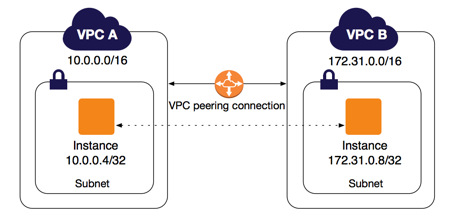

# Terraform -- VPC Peering Connection

## Overview

Found new infrastructure to build. this will allow me to get some hands on experience with different AWS services using Terraform. Following this [Guide](https://www.itwonderlab.com/en/terraform-ansible-aws-howto/)  and provided access to this [GitHub Repo](https://github.com/itwonderlab/terraform-aws-ec2-rds-basic-free) will give me a better understanding using different AWS Services along with Terraform Infrastructure.

-----


# Getting Started

### VPC-Peering

Generic Vpc-Peering Architecture including:
   - 2 VPCs
   - 4 subnets
   - 2 EC2 instances

This example will be refined and improved in later modules.

### Architecture


----

## Guides
- [Complete Terraform Guide](https://www.itwonderlab.com/en/terraform-ansible-aws-howto/)
- [GitHub Repo](https://github.com/itwonderlab/terraform-aws-ec2-rds-basic-free)
- [Create a VPC peering connection](https://docs.aws.amazon.com/vpc/latest/peering/create-vpc-peering-connection.html)
- [VPC peering configurations with routes to an entire VPC](https://docs.aws.amazon.com/vpc/latest/peering/peering-configurations-full-access.html#two-vpcs-full-access)
- [Update your route tables for a VPC peering connection](https://docs.aws.amazon.com/vpc/latest/peering/vpc-peering-routing.html)
- [Update your route tables for a VPC peering connection](https://docs.aws.amazon.com/vpc/latest/peering/vpc-peering-routing.html)

----

## Running Terraform

Run the following to ensure ***terraform*** will only perform the expected
actions:

```sh
terraform fmt
terraform validate
terraform plan
terraform init
terraform apply
```

## Tearing Down the Terraformed Infrastructure

Run the following to verify that ***terraform*** will only impact the expected
nodes and then tear down the cluster.

```sh
terraform plan
terraform destroy
```
----


## VPC Subnet Creation

When calling the *module* at `main.tf` refer the created `variables` to set the needed *vpc_id* for peering-connection

The VPC- Alpha will be created using the `10.0.0.0/16` cidr range. The subnet cidr range `10.0.0.4/24` See [ipv4 Subnet Calculator](https://www.site24x7.com/tools/ipv4-subnetcalculator.html)

The VPC- Alpha will be created using the `172.31.0.0/16` cidr range. The subnet cidr range `1172.31.0.8/24` See [ipv4 Subnet Calculator](https://www.site24x7.com/tools/ipv4-subnetcalculator.html)

*VPC using AWS availability zones with a private and a public network*

Instance placement has to take into account that data transfer between different Availability Zones has a cost, therefore achieving high availability by distributing infrastructure between Availability Zones has an impact on the total budget

----

## Notes::
- Your VPC peering connection (pcx-0370d265896c59b61 | test-peer) has been established.
To send and receive traffic across this VPC peering connection, you must add a route to the peered VPC in one or more of your VPC route tables

- VPC A:-
  -  cidr:: 10.0.0.0/16
  - subnet cidr:: 10.0.0.4/32

- VPC B:-
  - cidr:: 172.31.0.0/16
  - subnet cidr:: 172.31.0.8/32

----

**WARNING**: Terraform Best Practices recommends **NEVER** publicly provide infrastructure's `.tfvars` files since in this could contain confidential infromation. 

Since this is just a **Personal Project** to help better understand the **Terraform** nothing of value would be in this `.tfvars` file. In this `ReadMe` will be the `variables` used for this **Personal Project** since `.gitignore` will leave out this file due to Best Practices.

```
# network-base vars

vpc_name_a = "VPC_ALPHA"
vpc_cidr_a = "10.0.0.0/16"
vpc_tag_a  = "VPC_APLPHA"

pub_sub_cidr_a = "10.0.4.0/24"
pub_sub_tag_a  = "public_subnet_alpha"

priv_sub_cidr_a = "10.0.101.0/24"
priv_sub_tag_a  = "private_subnet_alpha"

internet_gw_tag_a = "igw-alpha"

route_table_tag_a = "route_table_alpha"

sg_description_a = "allow traffic"
sg_name_a        = "sg_name_alpha"
sg_tag_a         = "security_group_tag_alpha"

vpc_name_b = "VPC_BRAVO"
vpc_cidr_b = "172.31.0.0/16"
vpc_tag_b  = "VPC_BRAVO"

pub_sub_cidr_b = "172.31.8.0/24"
pub_sub_tag_b  = "public_subnet_bravo"

priv_sub_cidr_b = "172.31.101.0/24"
priv_sub_tag_b  = "private_subnet_bravo"

internet_gw_tag_b = "internet_gateway_tag_bravo"

route_table_tag_b = "route_table_bravo"

sg_name_b        = "sg_name_bravo"
sg_tag_b         = "security_group_tag_bravo"
sg_description_b = "Allow Traffic"

# ------
# compute-base vars

# public_subnet_id_a = ""
# public_security_group_id_a = ""

# public_subnet_id_b = ""
# public_security_group_id_b = ""

instance_type = "t2.micro"

tags_instance_alpha = "alpha_instance"

tags_instance_bravo = "bravo_instance"
```